# Lilly Technical Challenge Documentation Template

*This documentation template serves as a place for you to discuss how you approached this challenge, any issues you faced & how you overcame them, or any other points that you feel would be relevant for the interviewers to know. The text in italics is here to guide you - feel free to remove it once you fill out each section!*

***Not every section in this document is required. This is just a template to help get you started. Feel free to add or remove sections as you feel necessary.***

## Approach
For this challenge I began by browsing the files that were provided to me, both the ones that were within the scope as well as the ones that were outside the scope to identify what was provided to me and what was not. Although I was not entirely familiar with using Python in the backend, I have used JavaScript, HTML, and CSS in the frontend and Java in the backend before. I found a guide on how to utilise FastAPI to fetch and send data to and from the backend (https://www.restack.io/p/fastapi-answer-javascript-fetch), and then I managed to find a guide detailing how to display data in a dynamic table which has been fetched from an API (https://www.creative-tim.com/learning-lab/bootstrap/table-with-api-data/material-dashboard). I also found this entry on stack overflow that I would also make use of (https://stackoverflow.com/questions/74581857/fetching-data-to-table-row-and-table-column). The first thing I did was set up the function to fetch the data from the backend. Then I created function to display the data fetched in a simple table format to begin with. The next objective I wanted to tackle was handling the missing and invalid data returned by the API. I added error handling to the fetchMedicine method starting the a try and catch. I also edited the 'show' method by adding error handling for if the name or price is undefined or missing. The next objective involved sending data to the backend so I began by creating a form that the user can fill out that would let them send data to the backend. In order to add functionality to the form, I used this guide (https://developer.mozilla.org/en-US/docs/Learn_web_development/Extensions/Forms/Sending_forms_through_JavaScript). After getting the form to work and ensuring that submissions were being added, I started to add error handling and validation to the form to make sure valid data types are being entered into the fields in the form. I also made it so that the form is cleared after submission and that the displayed data is updated. The next feature I wanted to add was to give the user the ability to update an existing medicine with a new price. In order to do this I simply copied the same function and form from the createMedicine() method but changing certain values and also sending the POST request to a different URL. This only left the ability for the user to delete medicine from the backend. This required another form to fill out, this time only having the name field, and then sending a delete request to the backend using the name provided as a parameter. To do this I used another website (https://www.fastapitutorial.com/blog/fastapi-deleting-a-post/) to get an idea of what delete requests look like. The code was very similar to the previous functions, except using a DELETE request instead of a POST request. Later on I realised I had missed out one more function that was available in the backend which was the ability for the user to fetch the data for specific medicine. In order to tack this problem I once again created a form that only had the name field. This text put into this name field would need to be sent in the url, and so I had to research how to incorporate extra text into a URL component through URI encoding. The code is generally the same as the method used to fetch all the medicine, except there's quite a bit more validation for the response sent back by the backend in the case that the price is null or undefined. Also if the medicine was not something found in the backend an appropriate error message had to be sent. The final objective was the challenge objective which involved averaging the price of all the medicine currently in the backend. To approach this task I examined how the other API functions were written, and using similar code I made a function that added up all the prices for the medicine and divided it by the number of different medicine. Any medicine that was not a number would be treated as zero. The last thing I attempted was to use CSS to make the website more presentable. Since I do not have much experience in styling websites, I decided to take inspiration from other sources. I found this website (https://developer.mozilla.org/en-US/docs/Learn_web_development/Extensions/Forms/Styling_web_forms) where they were attempting to make a form that looked like a post card, and although that was not what I needed, I used the css for it as a basis for my styling.

## Objectives - Innovative Solutions
This task involved a lot of techniques that I was yet to be familiar with, which meant that I had to learn everything as I was programming to complete each task. For most of these methods, I would reverse engineer already existing functions that were provided or that I had created prior in order to rebuild them again to solve a different task. For example, with the challenge object, I had little experience with FastAPI or using Python in the backend, but using the methods that were already provided, I created a method to calculate the average of all the prices of the medicines. Furthermore, I made the forms that edit the database refresh the table of medicine so that any changes were immediately reflected, also making it so that number fields in the forms could only be filled in with numbers by adding a min value of 0 to them. For the createMedicine() method, I also learned about the different ways that form data could be encoded, and figured out what type of content was expected by the backend.

## Problems Faced
The first problem I faced was an Uncaught ReferenceError:
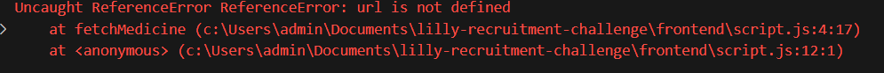
This was because I had not defined the variable 'url' in the function fetchMedicine.
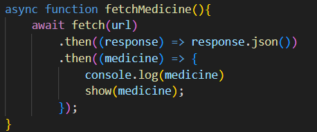
This was an easy fix as all I had to do was pass 'url' as a parameter.
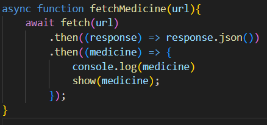

The second problem I faced was an Uncaught TypeError:
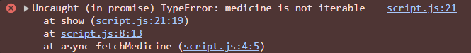
The reason for this error is because I had been treating the medicines returned by the API as an array, when in reality it was sending back an object that contained the array. In order to fix this code I simply had to access the actual array in the object 'data' sent back by the API.
Here is how the function looked before and after the fix I applied.
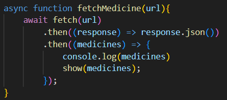
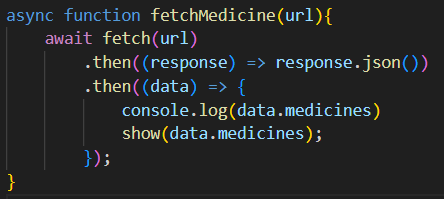

The third problem I faced was another Uncaught ReferenceError:
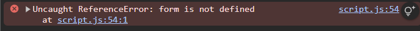
I realised that the reason for this error was because I had accidentally defined the createMedicine() function as well as the variable needed for it inside of the show() method. So to solve it I simply had to move it outside of the function.
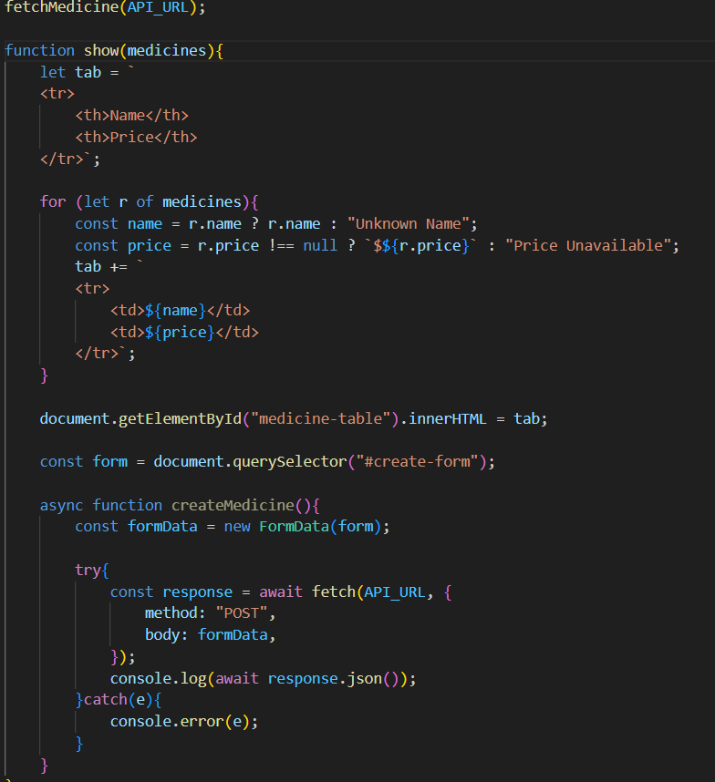
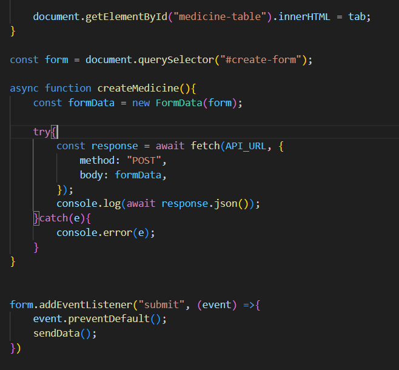

However, although I had fixed that issue, the uncaught reference error still remained.
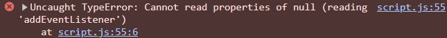
After examining the code, I realised the problem lied with the index.html code.
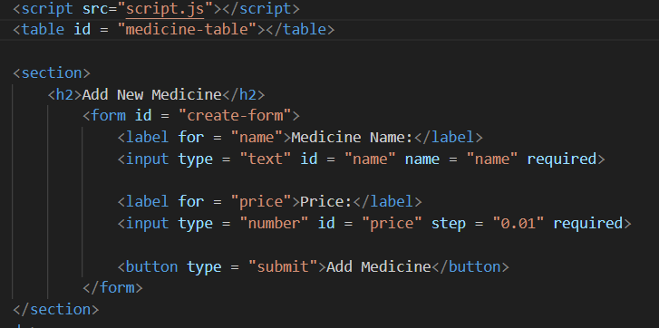
The issue is that I had the script running before the HTML for the form, meaning that when the script scanned for the form, the form had not been created yet as it was after it in index.html. The fix for this would be to move the script tags to just before the closing body tag.
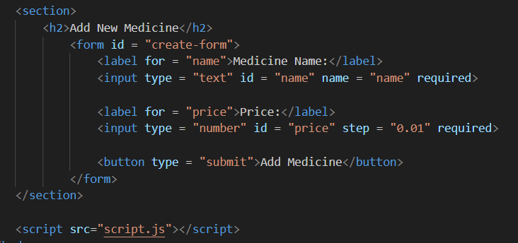

Soon after I faced yet another problem. I would receive this error:
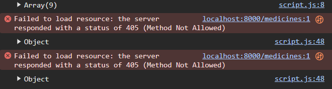
This error occured when the submit button was pressed, which made me assume that this was an issue to do with the POST request. My suspicions were correct, I had used the same API URL that I had used to fetch the medicines. This was incorrect as in order to create a medicine I would need to send the POST request to a different URL, this being 'http://localhost:8000/create'.
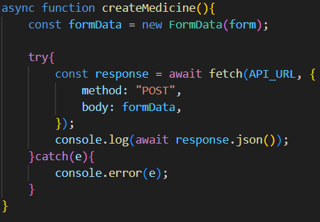
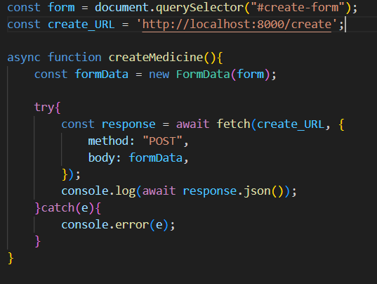

Another error was that the data sent to the backend was considered 'unprocessable':
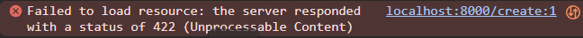
What may have caused the error is that the data was encoded in the wrong format. At the moment, the data is being sent as multipart/form-data, which is what I had assumed would be accepted by the backend. However, as the data is just textual, it needs to be made of URL-encoded lists of key/value pairs and sent with a content type of www-form-urlencoded.
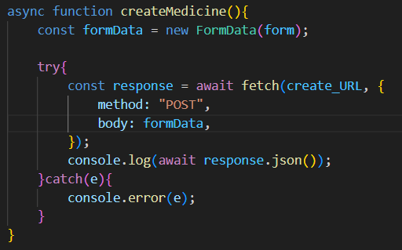
In order to figure this out, I had to make use of another website (https://developer.mozilla.org/en-US/docs/Learn_web_development/Extensions/Forms/Sending_forms_through_JavaScript) as well as (https://dev.to/getd/x-www-form-urlencoded-or-form-data-explained-in-2-mins-5hk6). Afterwards I edited my code to make use of the URLSearchParams function and to send the name and price from the FormData object as the parameters.
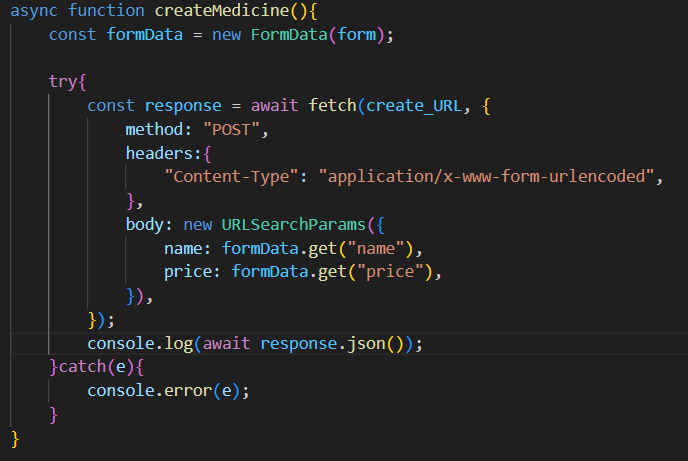
Although this helped fix half the problem, the price was still being rejected as it was the incorrect data type:
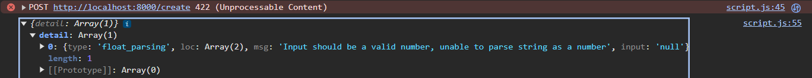
The input that the API was receiving was null, even though the form was being filled in with a number. At first I had assumed that the price was being sent as an incorrect data type, and so the API was treating it as null, but upon closer examination of the HTML code for the form revealed that I had forgotten to add a name field for the price.
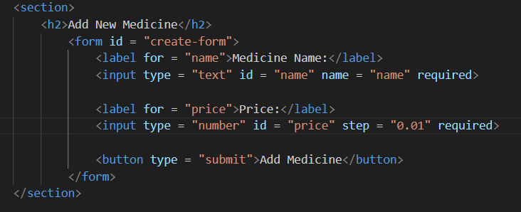
I added a name field and the code worked.
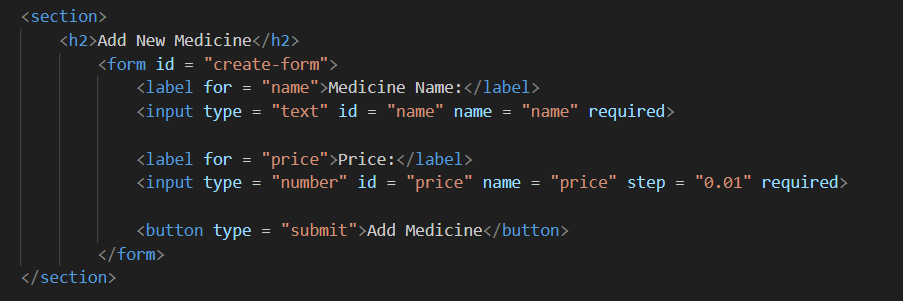

Another error I received was when I was working on the specific medicine search feature. This was a minor error that simply resulted in nothing being printed in the price output field of the website when the user searches for a specific medicine. What most likely caused this issue is that I had not passed the 'name' of the medicine as an input parameter for the function.
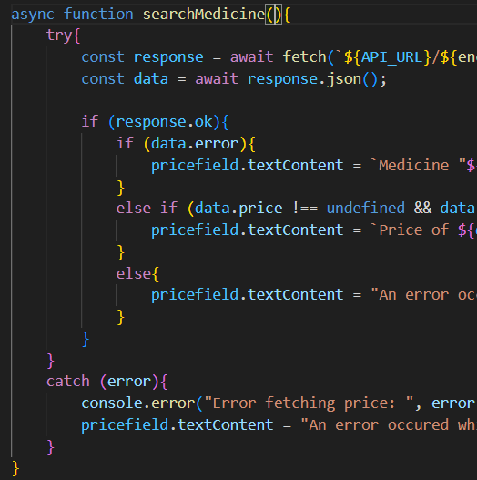
I simply added the name paremeter:
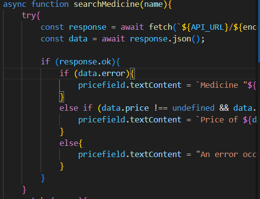
In addition to that, I had not referenced the search form for the event listener, instead I had referenced the field in which the price needs to be output:
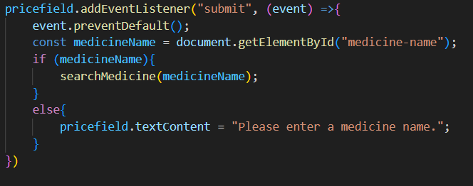
The fix was once again simple and only involved changing the referenced element to searchform:
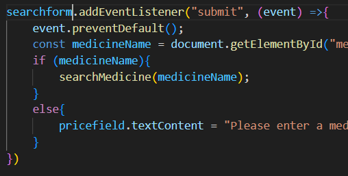

Afterwards I ran into another error to do with this feature, which was when data was submitted in the form, the returned message would be this:
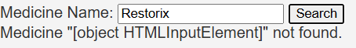
After some research, I found out that this was because I had passed the input element itself rather than the value of the element. So to fix it I made use of this website (https://www.w3schools.com/jsref/prop_text_value.asp) to learn about the .value property.
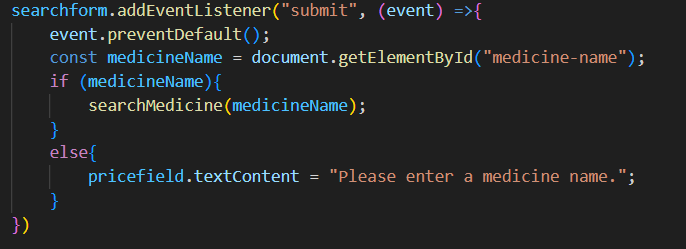
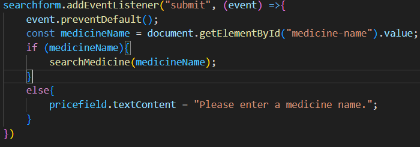

## Evaluation
Overall, I enjoyed this challenge as it helped me develop my knowledge of both JavaScript and Python, and taught me some new terminology that I had not known prior. Certain parts of this challenge most definitely went better than others, overall what took me the longest time to implement was the fetching of data from the backend to the frontend which did take some research and learning, but afterwards I was able to grasp the other tasks fairly well. If I were to do this task again, I definitely feel that I would be faster than I was before and had I more time I would have liked to implement a datalist for the 3 fields that would let the user automatically fill in the names of existing medicine. Furthermore I would have liked to add a proper way to present the data returned by the challenge objective function and I feel that the CSS could definitely be improved.